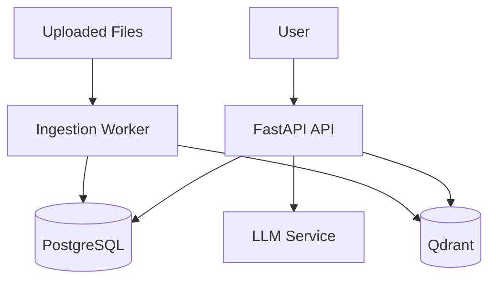

# AskMyDoc — AI Document Intelligence Platform

> 🚧 **Status:** Work in progress. This project is actively being improved with production-focused features.


Upload any document. Ask natural-language questions. Get fast, source-grounded answers.

AskMyDoc is a production-oriented RAG backend that combines document ingestion, vector retrieval, chat memory, and LLM generation in a clean API architecture. The goal is simple: turn unstructured files into reliable answers that users can trust.

## Why This Project Matters

### 🚀 Built For Real-World AI Workloads

Most AI demos break when they meet real-world constraints.
This project was designed with practical engineering priorities in mind:

- FastAPI-first architecture for scalability and clean service boundaries.
- PostgreSQL for transactional data + conversation history.
- Qdrant for semantic retrieval with low-latency vector search.
- Background ingestion pipeline for non-blocking UX.
- Test coverage for critical upload and ingestion flows.

This is not just a toy chatbot. It is a strong foundation for a multi-tenant SaaS document intelligence product.

## Product Vision

### 🎯 Who This Helps

AskMyDoc is built for teams that handle dense, high-value documents:

- Legal teams reviewing contracts and filings.
- Finance teams querying invoices and reports.
- Students and researchers working through long PDFs.
- Operations teams that need searchable internal knowledge.

## Core Capabilities Implemented

### ✅ Production-Oriented Features

- Upload and store PDF/TXT documents.
- Deduplicate files using SHA-256 hash checks.
- Parse and clean text (PyMuPDF + normalization pipeline).
- Semantic chunking with overlap for retrieval quality.
- Embedding generation using BGE-M3.
- Vector indexing and filtered retrieval in Qdrant.
- Session-based chat with persistent conversation history.
- RAG answer generation grounded in retrieved context.
- File download and document lifecycle endpoints.

## Architecture (Current)

### 🧠 System Snapshot

```text
User
	-> FastAPI API Layer
		 -> PostgreSQL (documents, sessions, messages, metadata)
		 -> Qdrant (chunk vectors + filtered similarity search)
		 -> LLM Service (answer generation)
```

### 🗺️ Architecture Diagram



### Retrieval Flow

1. User asks a question in a session.
2. Query is embedded via BGE-M3.
3. Qdrant returns the most relevant chunk IDs (filtered by session).
4. Chunk text is fetched from PostgreSQL.
5. LLM receives: system prompt + recent history + retrieved context.
6. Assistant answer is saved and returned.

## API Surface

### 🔌 Endpoints

### Health

- `GET /health`

### Documents

- `POST /api/v1/documents/` (multipart upload: `session_id`, `file`)
- `GET /api/v1/documents/`
- `GET /api/v1/documents/{doc_id}`
- `GET /api/v1/documents/{doc_id}/download`
- `DELETE /api/v1/documents/{doc_id}`

### Chat Sessions

- `POST /api/v1/sessions/`
- `GET /api/v1/sessions/`
- `GET /api/v1/sessions/{session_id}`
- `POST /api/v1/sessions/{session_id}/chat`

## Tech Stack

### 🛠️ Engineering Stack

- Backend: FastAPI, SQLAlchemy, Alembic
- Data: PostgreSQL
- Vector Store: Qdrant
- Embeddings: sentence-transformers (`BAAI/bge-m3`)
- LLM: OpenAI-compatible service layer
- Parsing: PyMuPDF
- Orchestration: Docker Compose
- Testing: Pytest

## Run Locally

### ⚙️ Quick Start

### 1. Clone and Configure

```bash
git clone <your-repo-url>
cd "RAG System"
cp .env.example .env  # or create .env manually
```

Make sure `.env` includes at least:

- `POSTGRES_USER`, `POSTGRES_PASSWORD`, `POSTGRES_DB`, `POSTGRES_HOST`, `POSTGRES_PORT`
- `DATABASE_URL`
- `QDRANT_HOST`, `QDRANT_PORT`, `QDRANT_URL`
- `OPENAI_API_KEY`

### 2. Start Infrastructure

```bash
make up
```

### 3. Prepare Python Environment

```bash
python3 -m venv .venv
source .venv/bin/activate
make install
```

### 4. Run Migrations

```bash
make migrate
```

### 5. Launch API

```bash
make run
```

The API will be available at `http://localhost:8000`.

## Run Tests

### 🧪 Quality Checks

```bash
make test
```

## Project Structure

### 📁 Repository Layout

```text
app/
	api/            # FastAPI routers and dependencies
	models/         # SQLAlchemy models
	repositories/   # Data access layer
	schemas/        # Pydantic request/response schemas
	services/       # Ingestion, embeddings, retrieval, LLM, Qdrant
	main.py         # FastAPI app entrypoint
tests/            # Router and service tests
alembic/          # DB migrations
```

## Version Journey (Portfolio Narrative)

### 🧭 Product Evolution

For portfolio and client presentation, this product is framed as a full V1-to-V4 execution journey.

### V1 — Core MVP

- Document upload and ingestion
- Vector retrieval + grounded answers
- Chat session memory
- FastAPI + PostgreSQL + Qdrant foundation

### V2 — Production System

- Redis caching layer
- Celery background workers
- Hybrid search (vector + BM25)
- JWT auth + multi-tenancy
- Docker + CI/CD + AWS deployment

### V3 — SaaS Platform

- Real-time streaming responses (SSE)
- Subscription billing (Stripe)
- Admin analytics dashboard
- Monitoring with Prometheus + Grafana
- Load testing for high concurrency

### V4 — Advanced AI

- OCR for scanned documents
- Structured parsing for forms/tables
- Multimodal RAG for richer inputs

## What This Demonstrates About My Engineering Work

### 💼 Why Clients Hire Me For This Type Of Work

- I build systems, not just endpoints.
- I design for reliability, maintainability, and scale from day one.
- I ship clean architecture with practical testing and deployment readiness.
- I can own backend + infrastructure + AI integration end-to-end.

If you are hiring for AI backend, RAG architecture, or production API delivery, this project reflects exactly how I execute.
