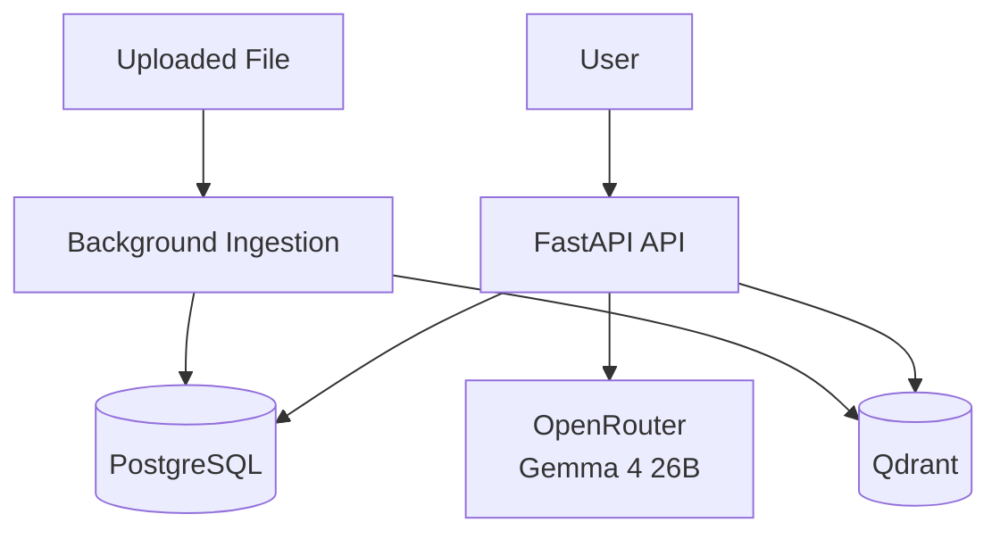

# AskMyDoc — AI Document Intelligence Platform

> ✅ **Status:** V1 complete and running.


Upload any document. Ask natural-language questions. Get fast, source-grounded answers.

AskMyDoc is a production-oriented RAG backend that combines document ingestion, vector retrieval, chat memory, and LLM generation in a clean API architecture. The goal is simple: turn unstructured files into reliable answers that users can trust.

## Why This Project Matters

### 🚀 Built For Real-World AI Workloads

Most AI demos break when they meet real-world constraints.
This project was designed with practical engineering priorities in mind:

- FastAPI-first architecture for scalability and clean service boundaries.
- PostgreSQL for transactional data and conversation history.
- Qdrant for semantic retrieval with low-latency vector search.
- Background ingestion pipeline for non-blocking UX.
- Dev/prod Docker workflow — hot reload in dev, minimal image in prod (~400MB).
- Test coverage for all critical upload, ingestion, and chat flows.

This is not just a toy chatbot. It is a strong foundation for a multi-tenant SaaS document intelligence product.

## Product Vision

### 🎯 Who This Helps

AskMyDoc is built for teams that handle dense, high-value documents:

- Legal teams reviewing contracts and filings.
- Finance teams querying invoices and reports.
- Students and researchers working through long PDFs.
- Operations teams that need searchable internal knowledge.

## Core Capabilities — V1

### ✅ Implemented

- Upload and store PDF/TXT documents with SHA-256 deduplication.
- File size validation with configurable limit.
- Text extraction and normalization pipeline (PyMuPDF).
- Semantic chunking with overlap for retrieval quality.
- Local ONNX embeddings via fastembed — no API key, no GPU, works offline.
- Vector indexing and session-scoped filtered retrieval in Qdrant.
- Session-based chat with persistent conversation history.
- RAG answer generation grounded in retrieved document context.
- Full document lifecycle: upload, list, get, download, delete.
- Full session lifecycle: create, list, get, delete (cascades documents and vectors).
- Background ingestion with status tracking (PENDING → PROCESSING → COMPLETED/FAILED).

## Architecture

### 🧠 System Snapshot

```text
User
  → FastAPI API Layer
      → PostgreSQL  (documents, chunks, sessions, messages)
      → Qdrant      (chunk vectors + session-filtered similarity search)
      → LLM Service (OpenRouter · Gemma 4 26B)
```

### 🗺️ Architecture Diagram



### Retrieval Flow

1. User asks a question in a session.
2. Query is embedded via fastembed (`bge-small-en-v1.5`, 384 dims, local ONNX).
3. Qdrant returns the most relevant chunk IDs filtered by session.
4. Chunk text is fetched from PostgreSQL.
5. LLM receives: system prompt + recent history + retrieved context.
6. Assistant answer is saved and returned.

## Tech Stack

### 🛠️ Engineering Stack

| Layer | Technology |
|---|---|
| Backend | FastAPI, SQLAlchemy, Alembic |
| Database | PostgreSQL 16 |
| Vector Store | Qdrant |
| Embeddings | fastembed — `BAAI/bge-small-en-v1.5` (384 dims, local ONNX) |
| LLM | OpenRouter — `google/gemma-4-26b-a4b-it:free` (provider-agnostic OpenAI-compatible client) |
| Parsing | PyMuPDF, langchain-text-splitters |
| Orchestration | Docker Compose (dev + prod profiles) |
| Testing | Pytest (15 tests, router + service + end-to-end) |

## API Surface

### 🔌 Endpoints

**Health**
- `GET /health`

**Documents**
- `POST /api/v1/documents/` — multipart upload (`session_id`, `file`)
- `GET /api/v1/documents/` — list all documents
- `GET /api/v1/documents/{doc_id}` — get document + status
- `GET /api/v1/documents/{doc_id}/download` — download original file
- `DELETE /api/v1/documents/{doc_id}` — delete document, file, and vectors

**Chat Sessions**
- `POST /api/v1/sessions/` — create session
- `GET /api/v1/sessions/` — list sessions
- `GET /api/v1/sessions/{session_id}` — get session with messages and documents
- `DELETE /api/v1/sessions/{session_id}` — delete session and all associated data
- `POST /api/v1/sessions/{session_id}/chat` — send message, get RAG answer

**Document status lifecycle:** `PENDING → PROCESSING → COMPLETED | FAILED`

Poll `GET /api/v1/documents/{doc_id}` after upload and wait for `COMPLETED` before chatting.

## Run Locally

### ⚙️ Quick Start

**1. Clone and configure**

```bash
git clone <your-repo-url>
cd "RAG System"
cp .env.example .env
```

Fill in `.env`:

```env
POSTGRES_USER=rag_user
POSTGRES_PASSWORD=rag_pass
POSTGRES_DB=rag_db

LLM_API_KEY=sk-or-v1-...      # openrouter.ai/settings/keys
LLM_MODEL=google/gemma-4-26b-a4b-it:free
```

**2. Start in dev mode** (hot reload — no rebuild on code changes)

```bash
make dev
```

**3. Run migrations**

```bash
make migrate
```

API is live at `http://localhost:8000`.
Adminer (DB browser) at `http://localhost:8080`.
Qdrant dashboard at `http://localhost:6333/dashboard`.

### ⚙️ Available Commands

```bash
make dev          # Start with hot reload (bind mount)
make prod         # Start production image (no bind mount)
make rebuild      # Stop → rebuild image → start prod
make migrate      # Apply Alembic migrations
make test         # Run test suite
make logs         # Tail container logs
make down         # Stop all containers
```

## Project Structure

### 📁 Repository Layout

```text
app/
  api/
    routers/      # documents.py, chat.py
    dependencies.py
  models/         # SQLAlchemy: Document, Chunk, ChatSession, ChatMessage
  repositories/   # Data access: DocumentRepository, ChunkRepository, ChatRepository
  schemas/        # Pydantic request/response schemas
  services/
    embeddings.py # fastembed wrapper
    ingestion.py  # extract → clean → chunk → embed → index pipeline
    llm.py        # OpenAICompatibleLLMService (OpenRouter by default)
    qdrant.py     # vector upsert, search, delete
    retrieval.py  # RAG context assembly
  config.py       # Pydantic Settings (reads .env)
  main.py         # FastAPI app entrypoint
tests/            # 15 tests — router, service, end-to-end
alembic/          # 3 migrations — initial schema, index refinement, v1 cleanup
docker-compose.yml          # Production services
docker-compose.override.yml # Dev overrides (hot reload, bind mount)
Dockerfile                  # python:3.11-slim + fastembed model baked in
```

## Version Journey

### 🧭 Product Evolution

### V1 — Core MVP ✅ Complete

- Document upload, ingestion, deduplication
- fastembed local embeddings (no GPU, no API key)
- Vector retrieval + grounded answers via OpenRouter (Gemma 4 26B)
- Session-based chat with persistent history
- Full lifecycle endpoints for documents and sessions
- Dev/prod Docker workflow, 15 tests, Alembic migrations

### V2 — Production System

- Redis caching layer
- Celery background workers
- Hybrid search (vector + BM25)
- JWT auth + multi-tenancy
- CI/CD + cloud deployment

### V3 — SaaS Platform

- Real-time streaming responses (SSE)
- Subscription billing (Stripe)
- Admin analytics dashboard
- Monitoring with Prometheus + Grafana

### V4 — Advanced AI

- OCR for scanned documents
- Structured parsing for forms and tables
- Multimodal RAG for richer inputs
- Multilingual embedding upgrade

## What This Demonstrates

### 💼 Why Clients Hire Me For This Type Of Work

- I build systems, not just endpoints.
- I design for reliability, maintainability, and scale from day one.
- I ship clean architecture with practical testing and deployment readiness.
- I can own backend + infrastructure + AI integration end-to-end.

If you are hiring for AI backend, RAG architecture, or production API delivery, this project reflects exactly how I execute.
