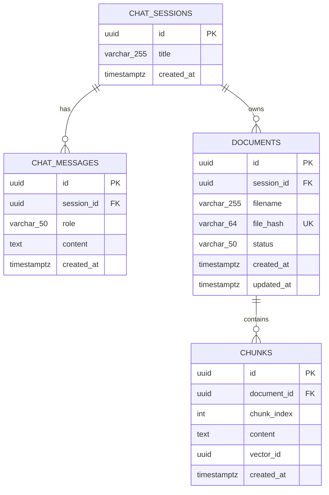

# Database Schema Visual

This document visualizes the current relational schema defined by Alembic migration `92c0a144db29` and SQLAlchemy models.

## ER Diagram

## Constraints and Indexes

- Primary keys: `chat_sessions.id`, `chat_messages.id`, `documents.id`, `chunks.id`
- Foreign keys:
  - `chat_messages.session_id -> chat_sessions.id` (ON DELETE CASCADE)
  - `documents.session_id -> chat_sessions.id` (ON DELETE CASCADE)
  - `chunks.document_id -> documents.id` (ON DELETE CASCADE)
- Unique constraint / index:
  - `documents.file_hash` is unique and indexed (`ix_documents_file_hash`)
- Secondary indexes:
  - `chunks.document_id` (`idx_chunk_document_id`)
  - `chunks.vector_id` (`ix_chunks_vector_id`)

## Data Lifecycle (Cascade Behavior)

- Deleting a chat session removes its messages and documents.
- Deleting a document removes all related chunks.
- This keeps orphan records out of the transactional database.
